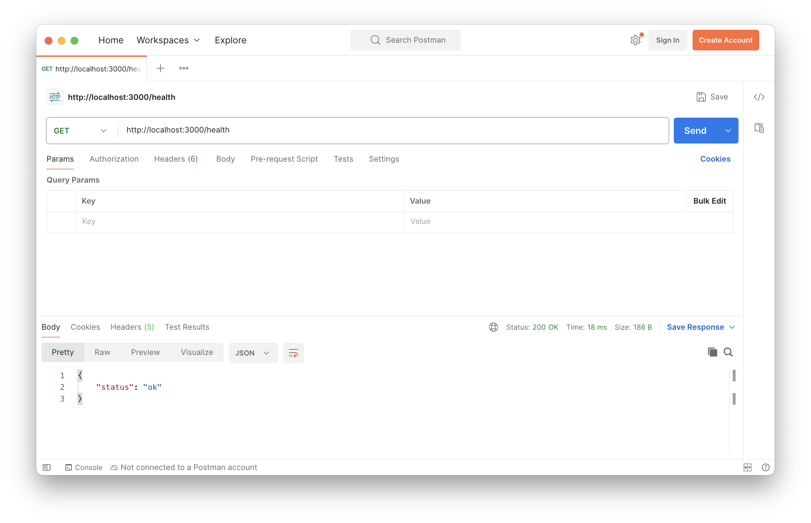
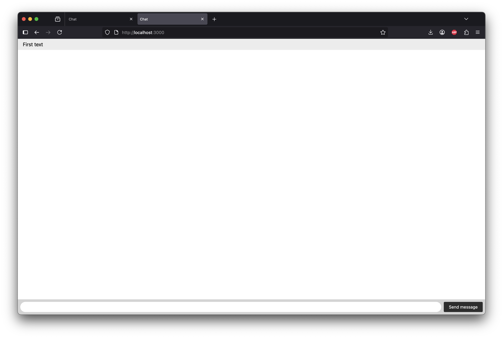
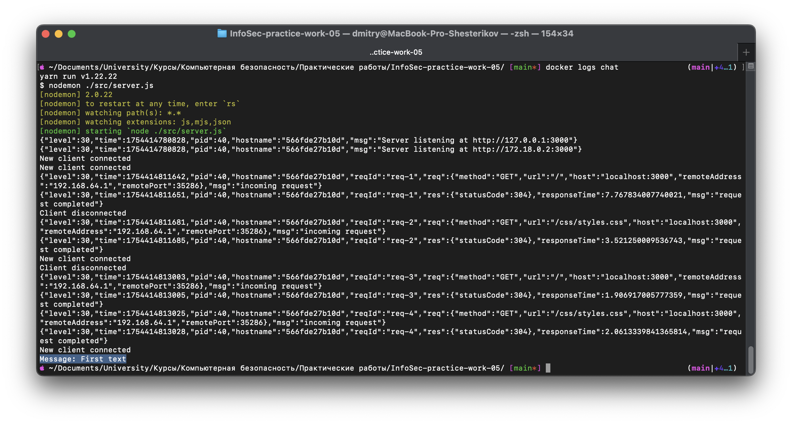

# Практическая работа 5
## End-to-end (e2e) шифрование
### Цель работы
Познакомиться с процессом e2e шифрования на примере реализации простого мессенджера
### Технические требования:
- Наличие [Docker](https://docs.docker.com/desktop/) и [Docker Compose](https://docs.docker.com/compose/install/)
- Наличие [cURL](https://curl.se/download.html) / [Postman](https://www.postman.com/downloads/) / [Insomnia](https://insomnia.rest/download)

### Ход работы:
1. Запустите приложение при помощи команды
`docker compose up -d --build`
2. Убедитесь, что приложение запущено корректно при помощи следующего cURL запроса
```cURL
curl --location 'http://localhost:3000/health'
```

В случае успешного запуска при выполнении cURL запроса отображается следующий текст


3. Откройте две вкладки в браузере со [следующим](http://localhost:3000) URL адресом
4. Введите произвольный текст сообщения в первой вкладке и отправьте его
5. Удостоверьтесь, что аналогичный текст представлен во второй вкладке


6. Удостоверьтесь, что текст пересылаемого сообщения представлен в логах socket-сервера при помощи команды `docker logs chat`


7. Модифицируйте исходный код `public/index.html` для реализации  e2e шифрования. Итогом модификации можно считать успешную передачу исходного сообщения в зашифрованном виде через socket-сервер, а также его успешную расшифровку с использованием шифровальных ключей на стороне клиента. Для этого воспользуйтесь библиотекой [CryptoJS](https://cryptojs.gitbook.io/docs). В качестве рекомендуемых алгоритмов используйте AES или RSA. На стороне UI клиента требуется внести соответствующие поля для задания ключей шифрования

### Документация:
[CryptoJS](https://cryptojs.gitbook.io/docs)

### Контрольные вопросы:
1. В чем разница симметричного и ассиметричного шифрования?
2. Как происходит процесс шифрования с использованием выбранного вами метода (в общих чертах)?